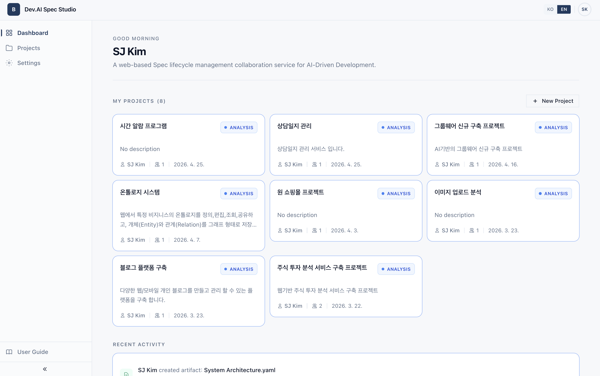
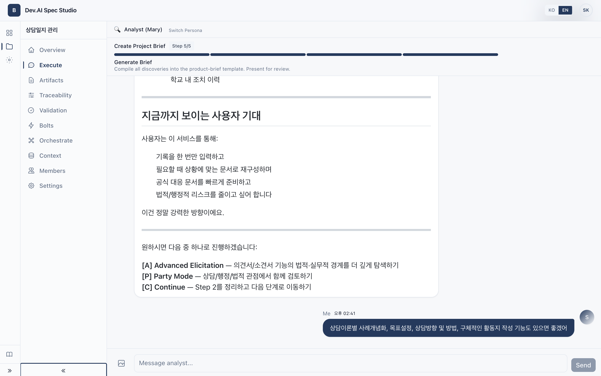
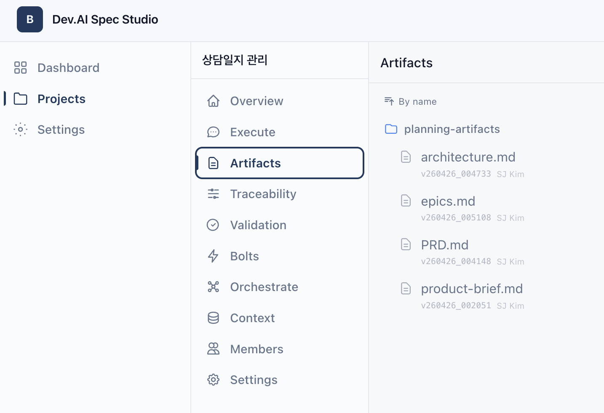
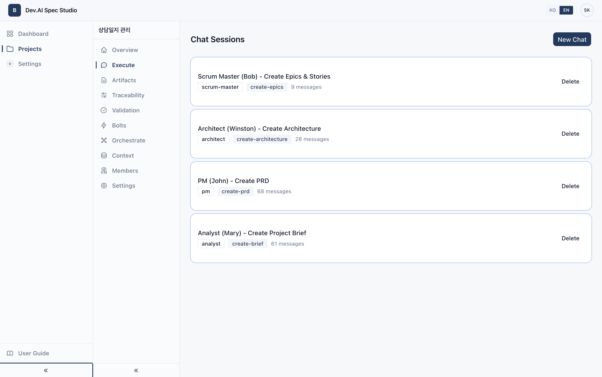
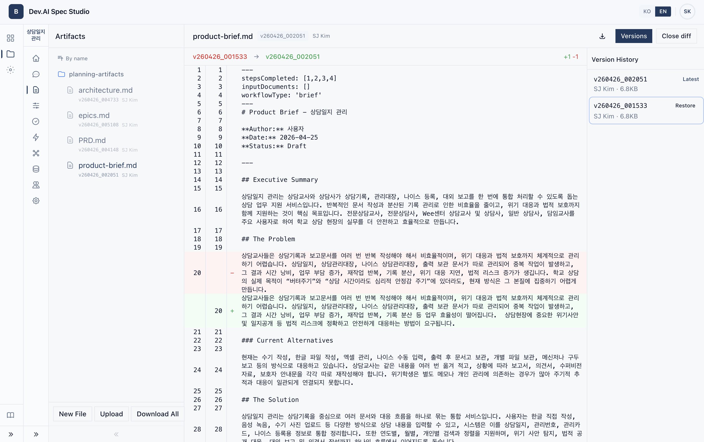
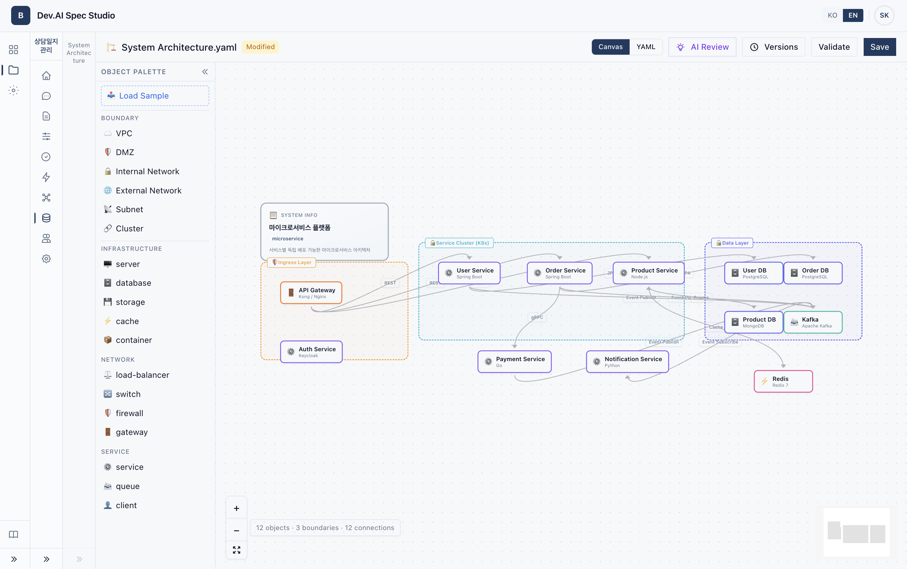
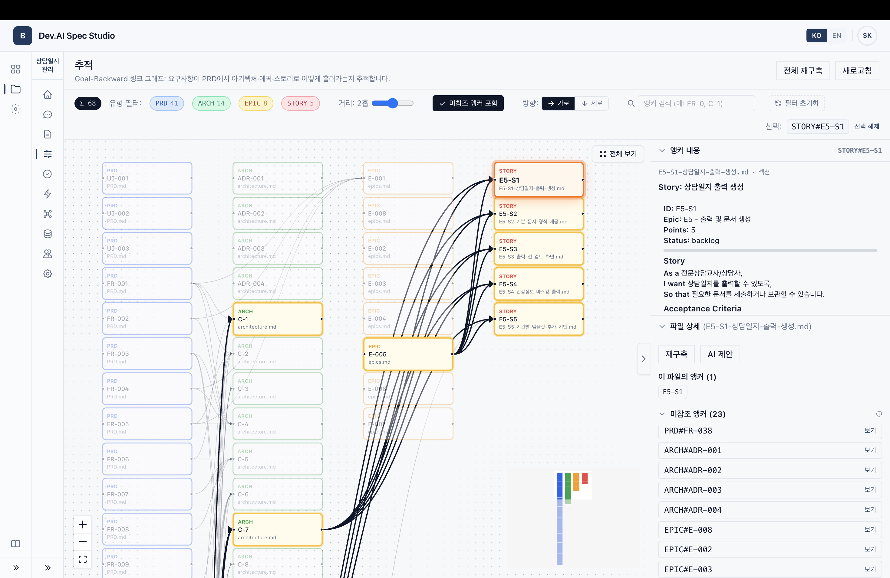
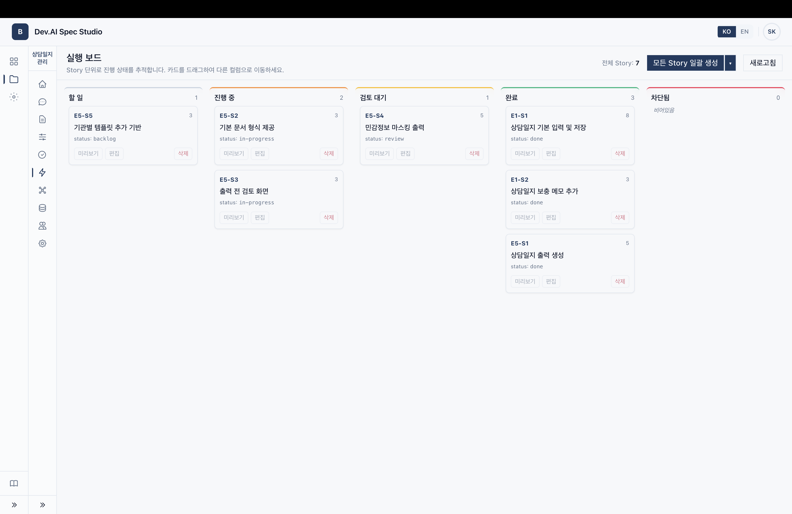

# Spec Studio

[한국어](./README.md) | **English**

**Enterprise AI-Driven Development web service based on SDD (Spec-Driven Development)**

A collaboration platform that systematically manages the entire spec lifecycle of software development with AI. Track everything from planning to implementation, validation, and operational readiness in a single workspace.

---

## Vision

With **Spec-Driven Development (SDD)** as the core methodology, this service aims to be an **Enterprise AI-Driven Development** platform where AI proactively generates, links, and validates artifacts (specs) across analysis, planning, design, and implementation.

It is designed by referencing and integrating the following industry-leading methodologies:

| Reference Methodology | Key Adopted Elements |
|-----------------------|----------------------|
| **BMad Method V6** | AI persona-based workflows, stage-by-stage artifact generation system |
| **GSD (Get Shit Done)** | Goal-Backward decomposition, atomic change tracking, fresh-context subagents |
| **AWS AI-DLC** | Inception → Construction → Operations 3-Phase, "Bolt"-unit execution, human-in-the-loop |

By combining these, we realize the SDD paradigm where **"Spec is both the starting point of development and the quality standard"** in a web environment.

---

## Core Values

- **Spec → Code Traceability** — Every FR/NFR in the PRD is connected to Architecture, UX, Story, and code scaffolding through a unidirectional graph and visualized.
- **9 AI Persona Collaboration** — Analyst, PM, Architect, UX Designer, Scrum Master, Tech Writer + 3 Construction roles (Developer, QA Engineer, DevOps Engineer) collaborate at each stage.
- **Inception → Construction Lifecycle** — In addition to existing planning/design artifacts, code scaffolding, test plans, CI/CD, and IaC artifacts are generated within the same workflow.
- **Bolt-Unit Execution** — Sprints are automatically decomposed into 1–3 hour "Bolts" with start/complete/approve lifecycle and activity log tracking.
- **Multi-Agent Orchestration** — Subagents with isolated contexts review artifacts in parallel and produce a synthesized result (no impact on main chat tokens).
- **Spec Health Score** — A 6-rule engine automatically validates consistency on artifact save and visualizes it as a 0–100 score.
- **Multi-User Real-Time Collaboration** — WebSocket-based real-time chat, automatic artifact saving, version management.
- **Multi-LLM Provider** — OpenAI, Anthropic, Google, Ollama, Dify, etc.

---

## Screenshots

### Dashboard — Project list & activity feed


### AI Persona Chat — Step-by-step workflow execution (with A/P/C menu)


### Artifacts Tree — Phase-based directory grouping + version tracking


### Chat Sessions — Persona × workflow session management


### Version Diff — Artifact change history with diff view + restore


### System Architecture Canvas — Visual modeling on Xyflow + AI Review


### Goal-Backward Traceability — PRD/ARCH/EPIC/STORY anchor graph + AI-suggested links


### Story Execution Board — Story kanban with bulk-generate / preview / edit deeplink


---

## Key Features

### SDD Workflows (12 types)

**Inception Phase**
- Create Brief, Create PRD, Validate PRD, Create UX Design, Create Architecture
- **Goal-Backward Analysis** — Decompose goals into verifiable preconditions and map to PRD FRs

**Implementation Phase**
- Create Epics, Sprint Planning, Create Story

**Construction Phase**
- **Generate Code Skeleton** — Story → directory tree + function signatures + TODOs bound to BDD scenarios
- **Create Test Plan** — BDD → unit/integration/E2E classification matrix + negative cases + fixtures
- **Design CI Pipeline** — Vendor-neutral YAML (triggers, stages, quality gates, rollback)
- **Create IaC** — Vendor-neutral IaC sketch (network/resources/secrets/environments)

**A/P/R/C menu**: Advanced Elicitation · Party Mode · Propose Mode · Continue

### Goal-Backward Traceability

- Stable anchor IDs (`FR-001`, `C-1`, `ADR-001`, `UF-001`, `E1-S3`, etc.) auto-assigned to artifact headers
- Declare derivation relationships between artifacts via `<!-- derived_from: PRD#FR-001, ARCH#C-1 -->` markers
- Traceability graph auto-rebuilds on file save (fire-and-forget)
- ReactFlow graph + orphan anchor panel on the `Traceability` page
- Per-file LLM Suggest button to infer additional links

### Bolt Mode (Short Execution Cycle)

- LLM auto-decomposes Sprint Status into 1–3 hour Bolts (skeleton + test plan per Story)
- 5-stage Kanban: To Do · In Bolt · Awaiting Approval · Done · Blocked
- Single active Bolt enforced (prevents parallel work)
- All start/complete/approve/block events recorded append-only in `bolt_activities`
- All file saves during an active Bolt are auto-linked to that Bolt's activity
- 7-day velocity counter

### Multi-Agent Orchestration

- Scenario-based parallel subagent execution (e.g., PRD Review = PM·Architect·UX·Analyst, 4 perspectives)
- Each subagent gets a fresh system prompt + isolated context → no impact on main chat token usage
- Auto-generates Synthesis with Critical/Major/Minor classification + conflicting opinions + recommended actions
- 60s individual / 90s overall timeout, partial failure tolerated

### Spec Validation Engine

- 6 rules (5 deterministic + 1 LLM):
  - `fr_covered_by_story` (error) — Whether every PRD FR is covered by a Story
  - `nfr_referenced_in_architecture` (warning) — Whether NFRs are referenced in Architecture components
  - `ux_flow_aligned_with_journey` (warning) — Whether UX User Flows are linked to PRD User Journeys
  - `orphan_anchor` (info) — Anchors not linked anywhere
  - `estimation_sanity` (info) — Sum of Story points vs Epic complexity
  - `contradictory_terms` (info, LLM) — Detect contradictions between PRD/Architecture
- Auto-rerun on file save (rule-based only; LLM rule is manually triggered)
- Issue diff: same fingerprints persist on rerun, disappeared fingerprints auto-marked `resolved`
- **Spec Health Score** 0–100 (error=15·warning=4·info=1 weighting)
- Per-issue Acknowledge / Resolve / Suppress actions

### Context Expansion

- **System Architecture Modeling** — Visual editor based on Xyflow + AS-IS/To-Be YAML management
- **Tech Stack** — Declare language/framework/DB/cloud/CI/security policy via YAML; Construction workflows always reference it first

### Artifact Management

- Markdown file create/edit/delete, drag-and-drop move/rename
- BMad template-based auto-generation
- Version management (YYMMDD_HHMMSS, modifier tracking, diff comparison, restore)
- Directory grouping: `planning-artifacts/`, `implementation-artifacts/`, `construction-artifacts/`, `context/`
- Bulk download (ZIP)
- 3 sample projects (P0 anchors + P1 Construction artifacts included)

### Chat & AI

- WebSocket-based real-time streaming responses
- Persona-specific system prompts + priority-based project context auto-load (60K char budget, separate 20K for Context Expansion)
- A/P/R/C quick actions, Party Mode, Propose Mode
- SAVE_FILE marker-based artifact auto-save from chat
- Story / Code Skeleton / Test Plan handle dynamic filenames (`E{n}-S{n}-...`) automatically

### Project Management

- Project create/update/delete, phase management
- Member invitations and roles (Owner/Member)
- Activity feed

### Admin Backoffice

- Login history, user management, project management, LLM API settings, guide page management

### UI/UX

- Korean/English multilingual
- Collapsible sidebar (9 menus: Overview · Chat · Artifacts · Traceability · Validation · Bolts · Orchestrate · Context · Members · Settings)

---

## Tech Stack

### Frontend
| Tech | Version | Purpose |
|------|---------|---------|
| Next.js | 14.x | React framework (App Router) |
| TypeScript | 5.x | Type safety |
| Tailwind CSS | 3.x | Utility CSS |
| Zustand | 5.x | State management |
| React Query | 5.x | Server state management |
| Axios | 1.x | HTTP client |
| @uiw/react-md-editor | 4.x | Markdown editor |
| @xyflow/react | 12.x | Diagrams (System Architecture, Traceability Graph) |
| Sonner | 2.x | Toast notifications |
| Lucide React | — | Icons |

### Backend
| Tech | Version | Purpose |
|------|---------|---------|
| Python | 3.12+ | Runtime |
| FastAPI | 0.115+ | Async web framework |
| SQLAlchemy | 2.x (async) | ORM |
| SQLite / PostgreSQL | — | Database |
| Alembic | 1.14+ | DB migrations |
| LiteLLM | 1.55+ | Multi-LLM provider |
| PyJWT | 2.x | JWT authentication |
| bcrypt | 4.x | Password hashing |
| WebSockets | 14.x | Real-time communication |
| Uvicorn | 0.34+ | ASGI server |

---

## Project Structure

```
Web_BMad01/
├── frontend/
│   ├── src/
│   │   ├── app/
│   │   │   ├── (auth)/                    # Login/Signup
│   │   │   └── (app)/                     # Auth-required routes
│   │   │       └── projects/[projectId]/
│   │   │           ├── (overview)/
│   │   │           ├── chat/
│   │   │           ├── files/
│   │   │           ├── traceability/      # P0 Goal-Backward graph
│   │   │           ├── validation/        # P4 Spec Health + issues
│   │   │           ├── bolts/             # P2 Bolt Kanban
│   │   │           ├── orchestrate/       # P3 Multi-Agent
│   │   │           ├── context/
│   │   │           ├── members/
│   │   │           └── settings/
│   │   ├── components/
│   │   │   ├── chat/                      # ChatWindow, PersonaSelector
│   │   │   ├── files/                     # FileTree, FileViewer, DiffView
│   │   │   │   ├── TraceGraph.tsx         # P0 ReactFlow graph
│   │   │   │   └── TracePanel.tsx
│   │   │   ├── bolts/BoltCard.tsx         # P2
│   │   │   ├── orchestrate/OrchestratePanel.tsx  # P3
│   │   │   ├── validation/                # P4
│   │   │   │   ├── SpecHealthScore.tsx
│   │   │   │   └── IssueList.tsx
│   │   │   ├── context/SystemDrawingCanvas.tsx
│   │   │   ├── layout/
│   │   │   ├── editor/
│   │   │   └── ui/
│   │   ├── lib/                           # API, i18n, WebSocket
│   │   ├── stores/                        # Zustand
│   │   └── types/
│   └── package.json
│
├── backend/
│   ├── app/
│   │   ├── api/                           # REST endpoints
│   │   │   ├── traceability.py            # P0
│   │   │   ├── bolts.py                   # P2
│   │   │   ├── orchestrate.py             # P3
│   │   │   ├── validation.py              # P4
│   │   │   └── ... (auth, files, chat, context, ...)
│   │   ├── models/
│   │   │   ├── traceability_link.py       # P0
│   │   │   ├── bolt.py                    # P2 (Bolt + BoltActivity)
│   │   │   ├── validation.py              # P4 (Run + Issue)
│   │   │   └── ... (user, project, file, ...)
│   │   ├── schemas/
│   │   ├── services/
│   │   │   ├── traceability_service.py    # P0 anchor extraction + LLM suggest
│   │   │   ├── bolt_service.py            # P2 plan/state-machine
│   │   │   ├── validation/                # P4 rule framework
│   │   │   │   ├── base.py
│   │   │   │   ├── registry.py
│   │   │   │   └── rules/                 # 6 rules
│   │   │   ├── validation_service.py      # P4 orchestration + diff
│   │   │   ├── samples/                   # Sample artifact data
│   │   │   └── ... (file_service, context_service, ...)
│   │   ├── llm/
│   │   │   ├── prompt_builder.py          # System prompt + Anchor convention
│   │   │   ├── context_builder.py         # Priority-based context loader
│   │   │   ├── orchestrator.py            # P3 SubAgent + run_parallel
│   │   │   └── provider.py
│   │   ├── bmad/                          # Persona/workflow/template metadata
│   │   └── core/                          # Security, dependencies, exceptions
│   ├── bmad_data/
│   │   ├── personas/                      # 9 (Analyst·PM·Architect·UX·SM·TW·Developer·QA·DevOps)
│   │   ├── workflows/                     # 13 (12 workflows + goal-backward)
│   │   └── templates/                     # 12 (existing 8 + code-skeleton·test-plan·ci-pipeline·iac)
│   ├── test_p0_p4_integration.py          # P0~P4 integration regression tests
│   ├── requirements.txt
│   └── .env.example
│
└── README.md
```

---

## Installation & Run

### Prerequisites
- **Node.js** 20+ (LTS)
- **Python** 3.12+
- **LLM API Key** (one of OpenAI, Anthropic, Google, etc.)

### 1. Clone the repository

```bash
git clone https://github.com/extox/Spec-Studio.git
cd Spec-Studio
```

### 2. Backend setup

```bash
cd backend

# Create and activate virtual environment
python3 -m venv .venv

# macOS/Linux:
source .venv/bin/activate

# Windows PowerShell:
# .venv\Scripts\Activate.ps1
# (If you get an execution policy error: Set-ExecutionPolicy -Scope CurrentUser RemoteSigned)

# Windows CMD:
# .venv\Scripts\activate.bat

# Install dependencies
pip install -r requirements.txt

# Configure environment variables
cp .env.example .env        # Windows CMD: copy .env.example .env
# Edit .env to change JWT_SECRET_KEY and ENCRYPTION_KEY
```

### 3. Frontend setup

```bash
cd frontend

# Install dependencies
npm install
```

### 4. Run

**Terminal 1 — Backend:**
```bash
cd backend
source .venv/bin/activate  # Windows PowerShell: .venv\Scripts\Activate.ps1
uvicorn app.main:app --reload --host 0.0.0.0 --port 8000
```

**Terminal 2 — Frontend:**
```bash
cd frontend
npm run dev
```

### 5. Access
- **Frontend:** http://localhost:3000
- **Backend API docs:** http://localhost:8000/docs

### 6. Initial Setup
1. Sign up (the first user is automatically granted admin privileges)
2. Settings → LLM API Settings: register your LLM provider and API key
3. Create a project → Load sample artifacts (recommended) → Start a workflow

### 7. Regression Tests (Optional)

```bash
cd backend
.venv/bin/python test_p0_p4_integration.py
```

86 P0~P4 assertions run against an isolated temporary SQLite DB.

---

## Environment Variables

| Variable | Description | Default |
|----------|-------------|---------|
| `DATABASE_URL` | Database connection string | `sqlite+aiosqlite:///./spec_data.db` |
| `JWT_SECRET_KEY` | JWT signing key (must change in production) | `dev-secret-key-change-in-production` |
| `JWT_ALGORITHM` | JWT algorithm | `HS256` |
| `ACCESS_TOKEN_EXPIRE_MINUTES` | Access Token expiration (minutes) | `30` |
| `REFRESH_TOKEN_EXPIRE_DAYS` | Refresh Token expiration (days) | `7` |
| `ENCRYPTION_KEY` | API key encryption key (change in production) | `dev-encryption-key-change-in-production` |
| `CORS_ORIGINS` | Allowed CORS origins (comma-separated) | `http://localhost:3000` |
| `HOST` | Server host | `0.0.0.0` |
| `PORT` | Server port | `8000` |

---

## Sample Projects

For projects with no artifacts, you can load BMad V6-grade sample artifacts. All samples include P0 anchor conventions and `derived_from` markers, so the Traceability graph and Validation results are meaningful immediately upon loading.

| Sample | Tech Stack | Description |
|--------|-----------|-------------|
| **TaskFlow** | Python, FastAPI, PostgreSQL, AWS | AI-powered to-do management. **Includes Construction artifacts (skeleton/test-plan/CI/IaC) + tech-stack context** |
| **SmartWork** | Java, Spring Boot, PostgreSQL, Azure | Enterprise groupware (portal, e-approval, board) |
| **TradeHub** | Java, Spring Boot, PostgreSQL, Azure | B2B e-commerce platform |

---

## SDD Lifecycle

This platform implements SDD in the following 4 phases.

### 1. Analysis
The **Analyst (Mary)** refines the project idea and writes the Product Brief.
- Workflows: Create Brief, Goal-Backward Analysis

### 2. Planning
The **PM (John)** and **UX Designer (Sally)** write the PRD and UX Spec.
- Workflows: Create PRD, Validate PRD, Create UX Design

### 3. Solutioning
The **Architect (Winston)** writes the system architecture and ADRs.
- Workflows: Create Architecture
- Components (C-1, C-2, ...) in artifacts are auto-linked to FRs/NFRs in the PRD.

### 4. Implementation & Construction
The **Scrum Master (Bob)** decomposes work into Epics/Stories and plans Sprints.
The **Developer (Dex)**, **QA (Quinn)**, and **DevOps (Ollie)** generate Construction artifacts.
- Workflows: Create Epics, Sprint Planning, Create Story, Generate Code Skeleton, Create Test Plan, Design CI Pipeline, Create IaC
- Bolt Mode decomposes Stories into 1–3 hour execution cycles.

### Stage-level Helpers (A/P/R/C)
- **[A] Advanced Elicitation** — Socratic questions, pre-mortem, red-team critique
- **[P] Party Mode** — Multi-persona 3-stage discussion
- **[R] Propose Mode** — AI auto-drafts the current stage's content
- **[C] Continue** — Proceed to the next stage

### Cross-Cutting Layers (stage-agnostic)
- **Multi-Agent Orchestration** — Parallel multi-perspective review of key artifacts like the PRD
- **Validation Engine** — Auto-validates cross-document consistency with 6 rules
- **Spec Health Score** — Visualizes project quality as a 0–100 score

### Reference Methodologies
- [BMad Method V6](https://github.com/bmadcode/bmad-method) — AI persona and workflow system
- [GSD (Get Shit Done)](https://github.com/gsd-build/get-shit-done) — Goal-Backward decomposition, fresh-context subagents
- [AWS AI-DLC](https://github.com/awslabs/aidlc-workflows) — Inception → Construction → Operations governance

---

## License

This project is licensed under the MIT License.
